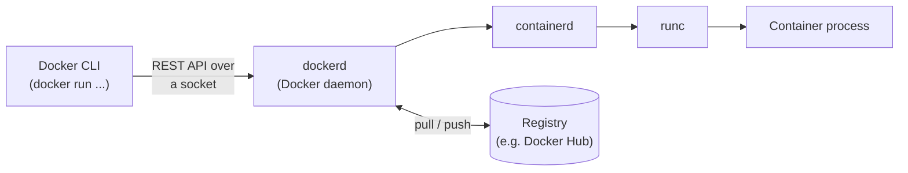
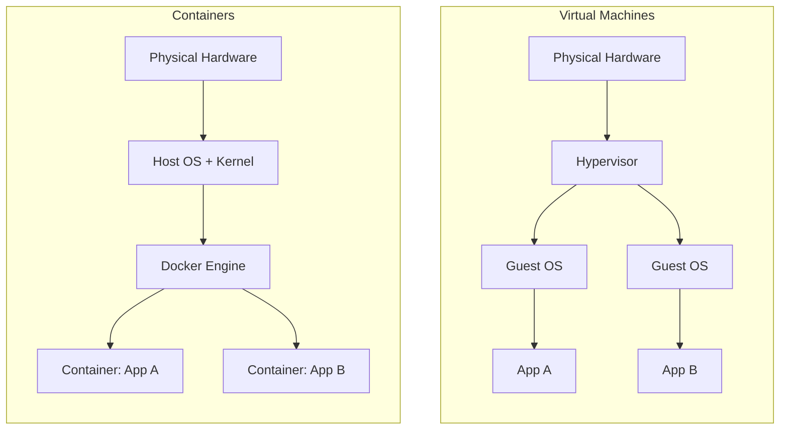
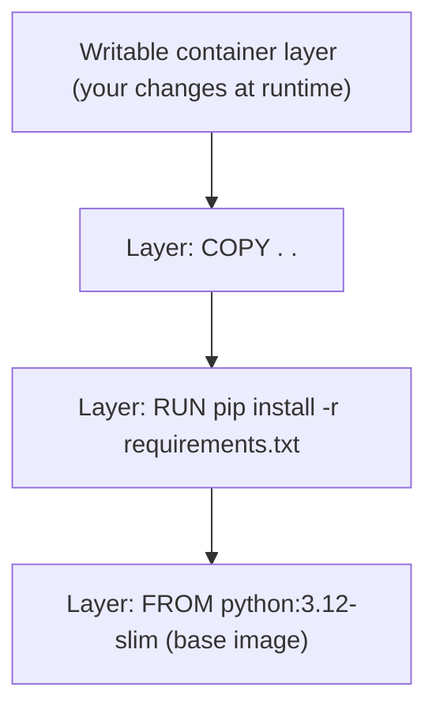

# 03 · Docker Architecture

## Learning objectives

- Describe the client–server model behind every `docker` command.
- Explain what makes containers lightweight compared to virtual machines (shared kernel).
- Know the names of the pieces under the hood: Docker CLI, daemon, containerd, runc.

## The client–server model

Every command you type (`docker run`, `docker build`, ...) is a **client** talking to a
long-running background **server process** — the Docker daemon (`dockerd`) — usually over a
local Unix socket (or a TCP socket for remote setups).



- **Docker CLI** — the `docker` command you type. It's just a thin client; it does no real work
  itself, it sends requests to the daemon.
- **`dockerd` (daemon)** — the long-running service that manages images, containers, networks,
  and volumes, and talks to the registry.
- **`containerd`** — a lower-level daemon (also used by Kubernetes) that manages the container
  lifecycle: pulling images, starting/stopping containers.
- **`runc`** — the low-level tool that actually creates the container: it asks the Linux kernel to
  set up namespaces and cgroups, then starts your process inside them.

You'll almost never talk to `containerd` or `runc` directly — but knowing they exist explains why
Docker isn't "one program," and why other tools (Kubernetes, Podman) can reuse the same layers.

## Containers vs. virtual machines

This is *the* architectural idea that makes containers fast and light.



- **VMs** virtualize an entire computer, including its own kernel and OS. Each guest OS takes
  gigabytes of disk and real minutes to boot, and needs its own share of CPU/RAM reserved upfront.
- **Containers** share the **host machine's kernel** and only isolate the process using two Linux
  kernel features:
  - **Namespaces** — give a container its own view of process IDs, network interfaces, mount
    points, hostname, etc., so it *looks* like it has the machine to itself.
  - **cgroups** (control groups) — limit and account for how much CPU, memory, and I/O a
    container can use, so containers can't starve each other.

Net effect: containers are megabytes (not gigabytes), start in milliseconds (not minutes), and you
can run far more of them on the same hardware.

> Note for Windows/Mac viewers: Docker still needs a Linux kernel to do this. Docker Desktop runs
> a small lightweight Linux VM behind the scenes for you automatically — you get the container
> experience without manually managing that VM. This is covered hands-on in
> [04-installing-docker](../04-installing-docker).

## Images are made of layers

One more architectural detail that explains a lot of Docker's speed: an image isn't one big blob —
it's a stack of read-only **layers**, one per instruction in the Dockerfile that changes the
filesystem. When you run a container, Docker adds one thin writable layer on top.



Layers are cached and shared: if ten containers all use `python:3.12-slim` as their base, that
layer is stored on disk **once** and reused by all of them. This is also why *build caching* works
the way it does — we'll use that directly in [08-building-custom-images](../08-building-custom-images).

## Demo

Nothing to build here — this is a "look under the hood" video. Use commands from topic 1 to point
at the concepts:

```bash
docker info          # Look at the "Server" section: version, storage driver, cgroup driver
docker version       # Client vs. Server versions, confirming the two-process model
docker system df     # Disk usage broken down by images / containers / volumes — layers in action
```

## Key takeaways

- `docker` commands are a client talking to a background daemon over an API, not a monolith.
- Containers are fast and light because they share the host kernel and use namespaces + cgroups —
  unlike VMs, which virtualize a whole machine.
- Images are stacks of cached, shareable layers, plus one writable layer per running container.

## Exercise

Run `docker system df -v` and identify at least one image layer being shared by more than one
image on your machine (look for repeated `SIZE` values across images that share a base image).

## Up next

[04 · Installing Docker](../04-installing-docker) — getting Docker actually running on your
machine.
