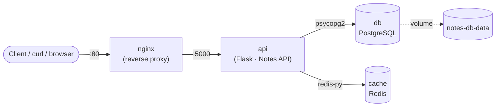

# 20 · Capstone Project

## Learning objectives

- See the entire course's app in its final, finished form, running as one stack.
- Map every Docker concept from the playlist to the specific file that demonstrates it.
- Walk away with a concrete list of ways to extend the project further, on your own.

## The finished stack



Four containers, one Docker network, one named volume — the same Notes API from topic 7, now
persistent, cached, configured, tested, hardened, observable, and deployed behind a reverse proxy.

## Where every course topic lives in this final project

| Topic | What to look at here |
|---|---|
| 7 · Dockerfile Basics | `Dockerfile`'s final stage — `FROM`, `WORKDIR`, `COPY`, `EXPOSE`, `CMD` |
| 8 · Building Custom Images | Dependency-first layer order; `.dockerignore` |
| 9 · Docker Volumes | `notes-db-data` volume on the `db` service in `docker-compose.prod.yml` |
| 10 · Docker Networking | Every service reaching others by name (`db`, `cache`, `api`) — no manual network setup needed, Compose provides it |
| 11 · Docker Compose | `docker-compose.yml` itself |
| 12 · Multi-Container Apps | The `cache` (Redis) service and `cache.py`'s cache-aside logic |
| 13 · Env Vars & Config | `config.py`, `.env.example`, `env_file:` in both compose files |
| 14 · Multi-Stage Builds | `Dockerfile`'s `builder` → `tester` → runtime stages |
| 15 · Docker Hub & Registries | (see topic 15's own folder for the tag/push script — same principle applies to this image) |
| 16 · Debugging & Logs | `app.py`'s structured logging + real `/health` check; `HEALTHCHECK` in the `Dockerfile` |
| 17 · Security Best Practices | Non-root `appuser`, `read_only`, `cap_drop: [ALL]`, `no-new-privileges` |
| 18 · Docker in CI/CD | `tests/`, the `tester` build stage, `db.init_db()`/`app.run()` guarded behind `__main__` |
| 19 · Production Deployment | `docker-compose.prod.yml`, `nginx.conf`, restart policies, resource limits |

## Running it

**Development** (direct access on :5000, easiest for iterating):

```bash
cd 20-capstone-project
cp .env.example .env
docker compose up --build -d
curl http://localhost:5000/notes
```

**Production-style** (everything behind Nginx on :80):

```bash
docker compose -f docker-compose.prod.yml up --build -d
curl http://localhost/notes
```

**Tests:**

```bash
docker build --target tester -t notes-api:test .
```

## Ideas to extend it further

Pick any of these as a next step — each one is a natural continuation of a real Docker/backend
skill, using this project as the base:

- **Authentication** — add an API key or JWT check in front of the routes; store the secret the
  way topic 13/17 taught (env var, never in the image).
- **Pagination** — `GET /notes?page=2&per_page=20`; a good excuse to revisit how caching keys need
  to account for query parameters, not just the route.
- **A second API consumer** — bring back topic 10's `client` container idea, but have it
  periodically poll `/notes` and print a summary, as a tiny second service in the compose file.
- **Real CI** — move `.github/workflows/docker-ci.yml` from topic 18 to an actual repository root
  and connect it to a real Docker Hub or GHCR account.
- **Kubernetes** — once you're comfortable here, translating `docker-compose.prod.yml` into
  Kubernetes Deployments/Services/ConfigMaps/Secrets is the natural next course topic beyond this
  playlist.
- **Observability** — add a `/metrics` endpoint and a Prometheus + Grafana pair of services to the
  compose file to visualize request counts and cache hit rate over time.

## Wrap-up

Congratulations — if you've followed all 20 videos, you've taken one small Flask app from a single
`docker run hello-world` all the way to a tested, hardened, multi-service stack behind a reverse
proxy, entirely using Docker. That's the whole job, in miniature: everything past this point is the
same handful of ideas (images, layers, volumes, networks, compose, env-based config,
multi-stage builds, health checks, least privilege, CI, and production guardrails) applied at
larger scale.

Thanks for following along — see [the root README](../README.md) for the full playlist if you want
to revisit any topic.
